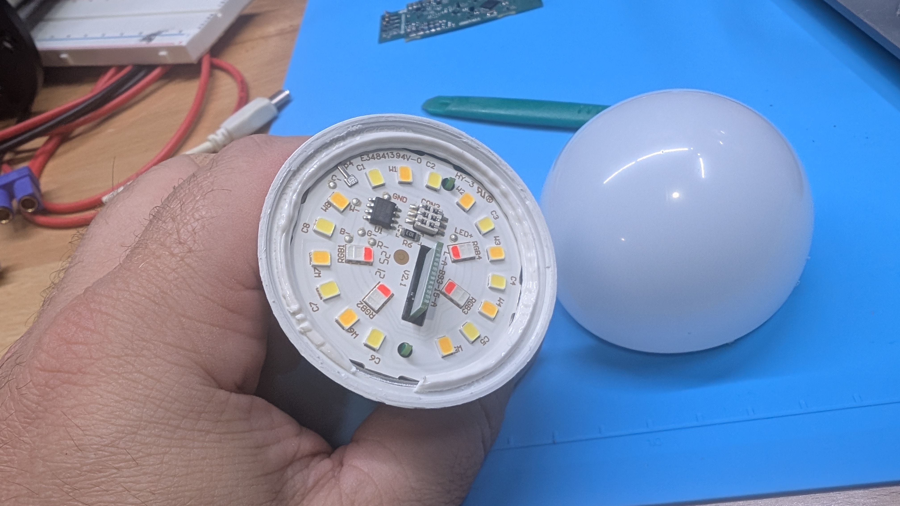
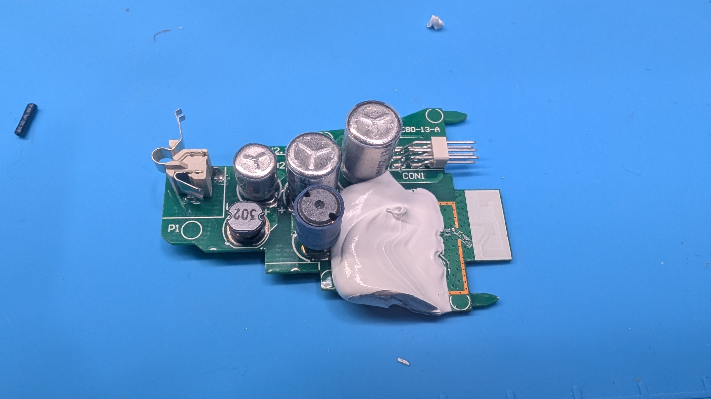
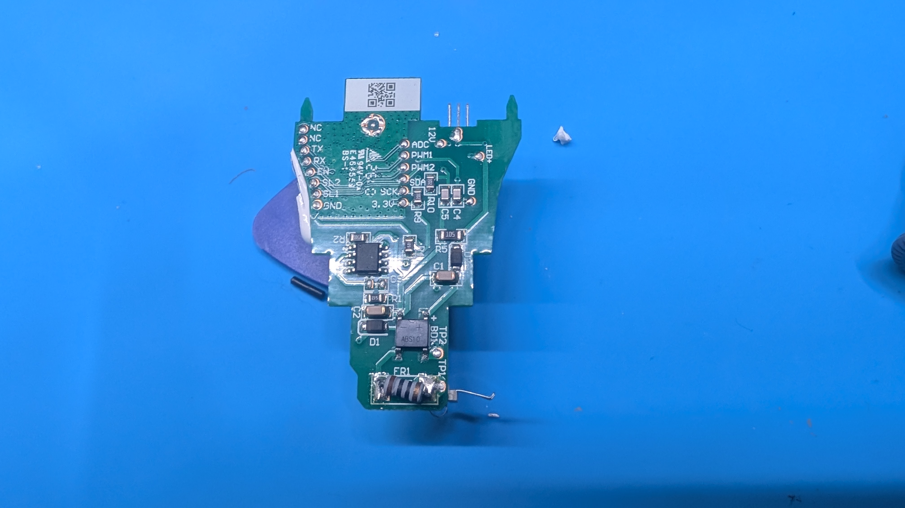
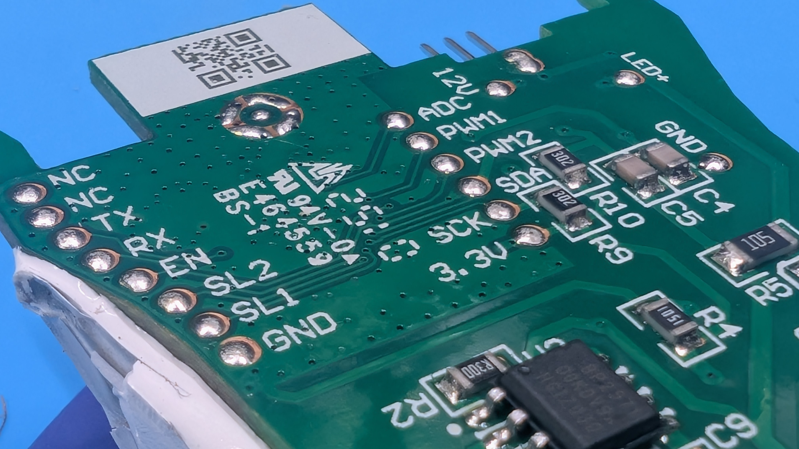
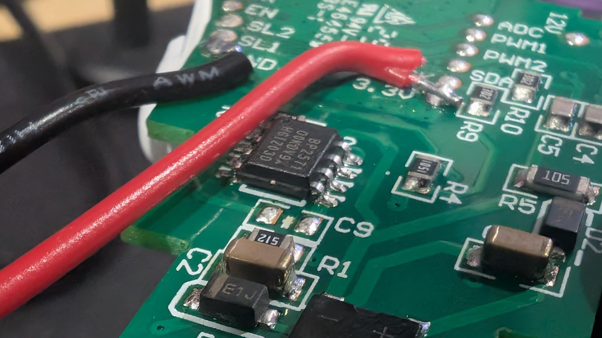
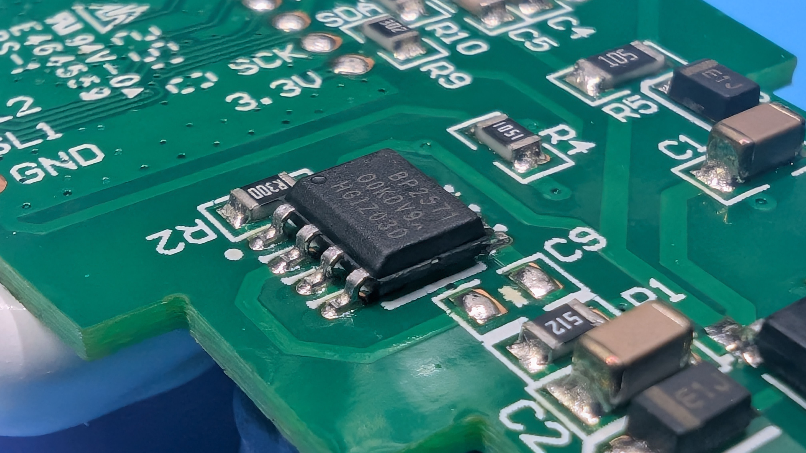
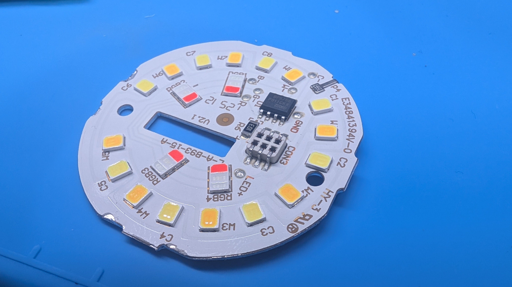
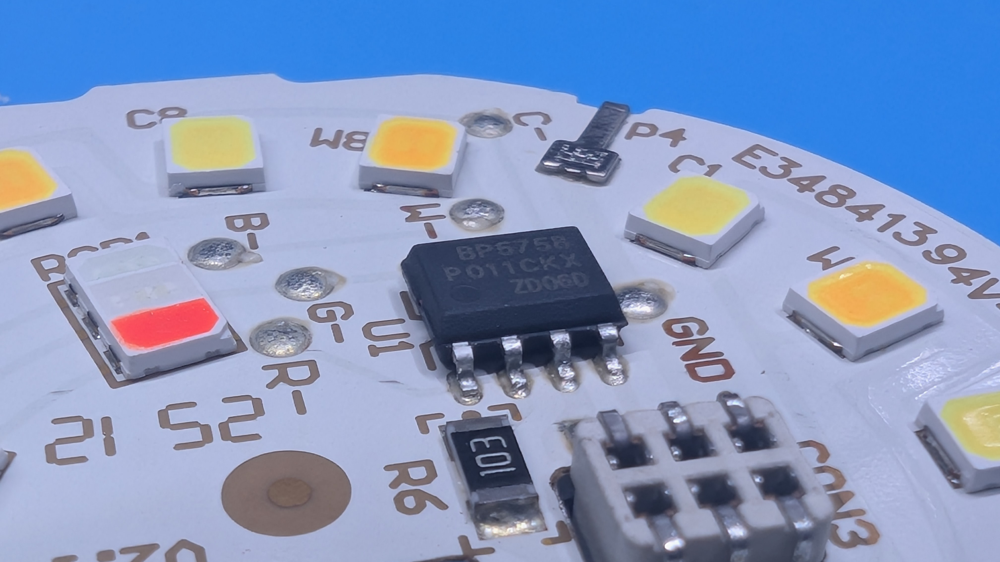

# OREiN A19 RGBTW Matter Smart Bulb

[Amazon B0BVQX6875](https://www.amazon.com/dp/B0BVQX6875) — OREiN Matter Smart Light Bulb, A19 RGBTW.

Same ESP32-C3 family as the WYZE bulb — this is the WYZE firmware with the LED-bus pins changed for OREiN's board layout.

- **SoC:** Espressif ESP32-C3FH4 (QFN32, 4MB flash)
- **LED driver:** IC marked `BP6758` (no public datasheet; closest documented analog is Bright Power's `BP5758D`). WYZE's `BP5758` bit-bang driver in `system_manager.cpp` was used and confirmed in real hardware.

## Pinout

| Signal | Pin | Notes |
|---|---|---|
| SDA (LED bus) | `GPIO6` | Confirmed via continuity + live LED test |
| SCL (LED bus) | `GPIO7` | Confirmed via continuity + live LED test |
| PWM2 | `GPIO4` (chip pin 9) | Confirmed via continuity, but confirmed to do nothing observable to the LED array (bench-tested 2026-09-12: toggling it alone changed neither color nor white brightness). Consistent with the LED board's 6-pin connector not including this pin at all — see the smartbulb hardware-notes project for the full pinout. Not driven by firmware. |
| PWM1 | unidentified | No continuity found to any chip pin so far. |
| Boot strap | `GPIO8` → 3.3V | Joint Download Boot mode, together with GPIO9 |
| Boot strap | `GPIO9` → GND | |
| `EN` / `CHIP_EN` | reset | Straps latch on the EN low→high edge — set them before resetting |
| `TX` / `RX` | UART0 | 115200 8N1 |

## Flashing

1. Wire a USB-to-UART adapter: `TX`→chip `RX`, `RX`→chip `TX`, common `GND`.
2. Ground `GPIO9`, pull `GPIO8` to 3.3V, then pulse `EN` to reset.
3. `cd firmware && pio run -e orein -t upload --upload-port /dev/ttyACM1` (see
   `firmware/README.md` for the full build workflow).
4. Un-ground `GPIO9`, power-cycle.
5. Connect to AP `Nightlight` / `Nightlight12345`, web UI at `192.168.4.1`.

## Teardown photos

Three stacked PCBs inside: an AC/DC power board, a control board (carries the ESP32-C3 module), and the LED array board. Useful if you're opening up the same bulb or a same-chip clone.

- The actual ESP32-C3 SoC lives on **this** board (near `CON1`), not on the control board — it's a bare glob-top QFN32 die, marked `ESP32-C3` / `FH4P494760` / `JE02MCA249` once the epoxy is scraped off. The shielded, QR-labeled "module" on the control board is a separate, unconfirmed sub-assembly, not the radio.

- Clearest shot of the full pad-label silkscreen — this is the header referenced in the [Pinout](#pinout) table above.

- Test leads clipped onto the `BP2571` buck-converter area (near `SL1`/`SL2`/`3.3V`) while confirming pinout by continuity.

- `BP2571` (SOIC-8) — a Bright Power Semiconductor non-isolated buck converter, feeds the ESP32-C3 module's 3.3V rail.

- `BP6758` (SOIC-8) — the LED driver IC, no public datasheet under this exact part number; closest documented analog is Bright Power's `BP5758D`. Confirmed protocol-compatible with the `BP5758` bit-bang driver used here.

## Known issues

- The AP can be slow to allow connections, give it a little bit of time and then reconnect and go to `192.168.4.1`
- RGB and white are both controllable from the web UI's color picker, driven entirely
  over the LED bus (`GPIO6`/`GPIO7`) - see the PWM2 row above for why that's the only
  pin involved.
