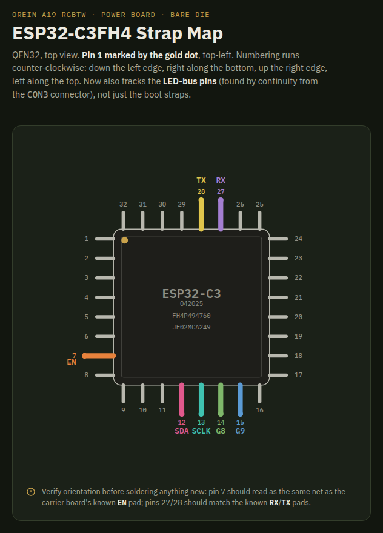
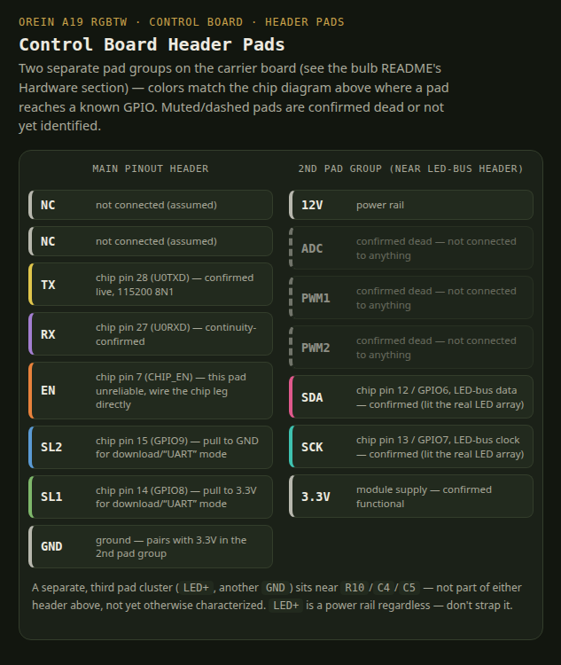

# OREiN A19 RGBTW Matter Smart Bulb

[Amazon B0BVQX6875](https://www.amazon.com/dp/B0BVQX6875) — OREiN Matter Smart Light Bulb, A19 RGBTW.

Same ESP32-C3 family as the WYZE bulb — this is the WYZE firmware with the LED-bus pins changed for OREiN's board layout.

- **SoC:** Espressif ESP32-C3FH4 (QFN32, 4MB flash)
- **LED driver:** IC marked `BP6758` (no public datasheet; closest documented analog is Bright Power's `BP5758D`). WYZE's `BP5758` bit-bang driver in `system_manager.cpp` was used and confirmed in real hardware.

## Pinout




| Signal | Pin | Notes |
|---|---|---|
| SDA (LED bus) | `GPIO6` | Confirmed via continuity + live LED test |
| SCL (LED bus) | `GPIO7` | Confirmed via continuity + live LED test |
| Boot strap | `GPIO8` → 3.3V | Joint Download Boot mode, together with GPIO9 |
| Boot strap | `GPIO9` → GND | |
| `EN` / `CHIP_EN` | reset | Straps latch on the EN low→high edge — set them before resetting |
| `TX` / `RX` | UART0 | 115200 8N1 |

## Flashing

1. Wire a USB-to-UART adapter: `TX`→chip `RX`, `RX`→chip `TX`, common `GND`.
2. Ground `GPIO9`, pull `GPIO8` to 3.3V, then pulse `EN` to reset.
3. `pipx install esptool`
4. ```
   esptool --port /dev/ttyUSB0 --baud 460800 write_flash \
     0x0     bins/bootloader.bin \
     0x8000  bins/partitions.bin \
     0x10000 bins/firmware.bin
   ```
   Or build + flash directly: `platformio run -e esp32-c3-devkitm-1 -t upload --upload-port /dev/ttyUSB0`
5. Un-ground `GPIO9`, power-cycle.
6. Connect to AP `Nightlight` / `Nightlight12345`, web UI at `192.168.4.1`.

## Known issues

- The AP can be slow to allow connections, give it a little bit of time and then reconnect and go to `192.168.4.1`
- Controlling the leds has not been supported yet. This copied from the Wyze implementation and changed relevant GPIO but haven't implemented any LED controls.
